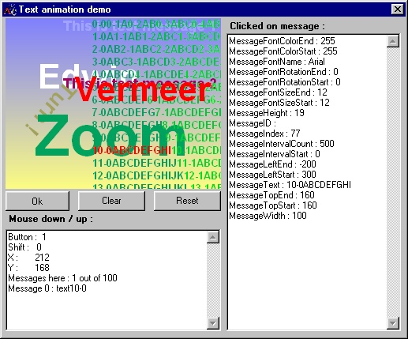



## Text animation \(position, rotation, size and color\)

### Description

New version at http://www.planet-source-code.com/vb/scripts/ShowCode.asp?txtCodeId=24869&lngWId=1

With this control you can flicker free animate multiple text lines. You can animate position, rotation, size and color. During the animation every text line is clickable.
 
### More Info
 

             |
---                |---
**Submitted On**   |2001-01-10 08:51:58
**By**             |[Edwin Vermeer\.](https://github.com/Planet-Source-Code/PSCIndex/blob/master/ByAuthor/edwin-vermeer.md)
**Level**          |Intermediate
**User Rating**    |4.7 (107 globes from 23 users)
**Compatibility**  |VB 6\.0
**Category**       |[Custom Controls/ Forms/  Menus](https://github.com/Planet-Source-Code/PSCIndex/blob/master/ByCategory/custom-controls-forms-menus__1-4.md)
**World**          |[Visual Basic](https://github.com/Planet-Source-Code/PSCIndex/blob/master/ByWorld/visual-basic.md)
**Archive File**   |[CODE\_UPLOAD140361222001\.zip](https://github.com/Planet-Source-Code/edwin-vermeer-text-animation-position-rotation-size-and-color__1-14615/archive/master.zip)

